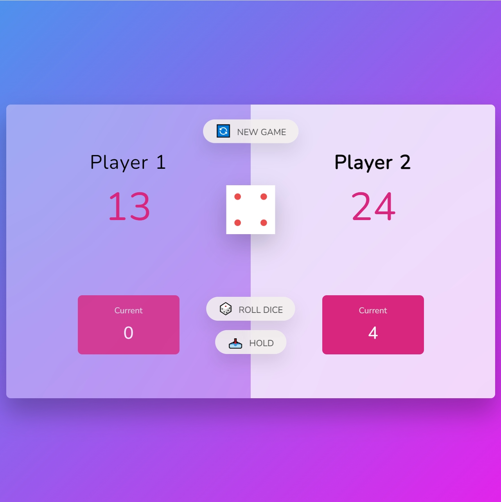
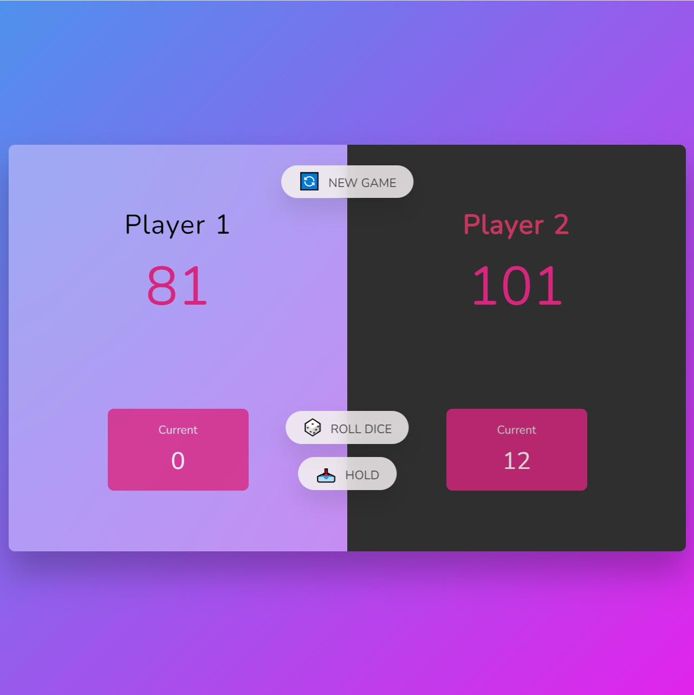

# Pig-Game

## Description

Pig is a simple and fun dice game first described in print by John Scarne in 1945. Players take turns to roll a single die as many times as they wish, adding all roll results to a running total. However, if a player rolls a 1, they lose their gained score for that turn and it becomes the next player's turn.

## Rules

1. Players take turns to roll a single die.
2. On each turn, the player can roll the die as many times as they wish.
3. Each roll adds the result to a running total for the turn.
4. If the player rolls a 1:
   - They score nothing for that turn.
   - It becomes the next player's turn.
5. If the player rolls any other number, it is added to their turn total and the turn continues.
6. The player can choose to "hold" at any point:
   - The turn total is added to their overall score.
   - It becomes the next player's turn.
7. The first player to reach 100 or more points wins the game.

## Interface

- **Overall Score**: Displays the overall scores for both players.
- **Current Score**: Shows the running total for the current turn.
- **Roll Dice Button**: Rolls the die and updates the current score.
- **Hold Button**: Adds the current score to the player's total score and switches the turn to the other player.
- **New Game Button**: Resets the game to the initial state.

## How to Play

1. Player 1 starts by clicking the "Roll Dice" button to roll the die.
2. The result is added to the current score.
3. Player 1 can choose to "Roll Dice" again or "Hold".
4. If Player 1 rolls a 1, their turn ends and it becomes Player 2's turn.
5. Player 2 follows the same steps.
6. The game continues until one player reaches 100 points or more.
7. Click the "New Game" button to start a new game.

## Screenshot

## Project URL

Try this game online :) [Number-Guessing-Game](https://icy-guo.github.io/Number-Guessing-Game/)

Enjoy playing Pig Game!
